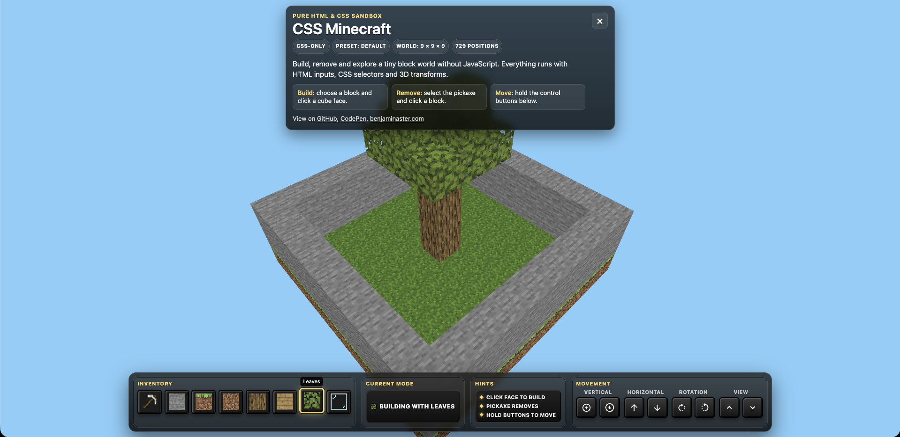

# CSS Minecraft

A Minecraft clone made with pure HTML & CSS – no JavaScript.

Play the original game: [benjaminaster.com/css-minecraft](https://benjaminaster.com/css-minecraft/)



## Project overview

This project renders a small Minecraft-style world directly in the DOM using Pug and SCSS.

There is no JavaScript controlling the game state. The interaction works through HTML radio inputs, labels, CSS selectors, `:has()`, 3D transforms and paused CSS animations.

## Source files

The repository should keep the source files:

```text
index.pug
main.scss
icons.css
assets/
README.md
package.json
pnpm-lock.yaml
```

The generated files do not need to be committed:

```text
index.html
main.css
main.css.map
```

These files can be regenerated locally from the source files.

## Requirements

You need Node.js and pnpm.

Check your installed versions:

```bash
node -v
pnpm -v
```

If pnpm is not installed, install it with Corepack:

```bash
corepack enable
corepack prepare pnpm@latest --activate
```

Or install it globally with npm:

```bash
npm install -g pnpm
```

## Install dependencies

After cloning the project, install the dependencies:

```bash
pnpm install
```

This installs the local development tools used by the project:

- `pug-cli`
- `sass`
- `concurrently`

You do not need to install `pug` or `sass` globally.

## Build

Generate the compiled HTML and CSS:

```bash
pnpm build
```

This creates:

```text
index.html
main.css
main.css.map
```

These generated files are ignored by Git.

## Development mode

Run the Pug and Sass watchers:

```bash
pnpm dev
```

This keeps watching:

```text
index.pug  -> index.html
main.scss  -> main.css
```

Important: `pnpm dev` only compiles and watches files. It does not start a web server by itself.

## Run locally

Use two terminal tabs.

Terminal 1:

```bash
pnpm dev
```

Terminal 2:

```bash
python3 -m http.server 8000
```

Then open:

```text
http://localhost:8000
```

The browser will serve the generated `index.html`.

When you edit `index.pug` or `main.scss`, `pnpm dev` regenerates the compiled files. Refresh the browser to see the changes.

## Alternative local run

You can also build once and then serve the folder:

```bash
pnpm build
python3 -m http.server 8000
```

Then open:

```text
http://localhost:8000
```

## Package scripts

The project includes these scripts:

```bash
pnpm build
```

Compiles Pug and Sass once.

```bash
pnpm build:pug
```

Compiles `index.pug` into `index.html`.

```bash
pnpm build:sass
```

Compiles `main.scss` into `main.css`.

```bash
pnpm dev
```

Runs both Pug and Sass in watch mode.

```bash
pnpm dev:pug
```

Watches and compiles only `index.pug`.

```bash
pnpm dev:sass
```

Watches and compiles only `main.scss`.

## World configuration

The world size is configured at the top of `index.pug`:

```pug
- const world = { layers: 9, rows: 9, columns: 9 };
```

These values mean:

- `layers`: vertical height of the world.
- `rows`: depth of the world.
- `columns`: width of the world.

The default world is:

```text
9 layers * 9 rows * 9 columns = 729 world positions
```

## Performance note

This project creates the interactive world directly in HTML.

Each position creates one radio group and one cube option per block type. Each cube also includes labels for the cube faces.

Because of that, increasing the world size can quickly make the DOM much heavier.

Recommended presets:

```pug
// Small
- const world = { layers: 7, rows: 7, columns: 7 };

// Default
- const world = { layers: 9, rows: 9, columns: 9 };

// Large
- const world = { layers: 11, rows: 11, columns: 11 };
```

For larger worlds, a JavaScript-based version would be more appropriate because it could render only the visible or changed blocks instead of generating every possible block state in advance.

## Browser support

This project requires support for the CSS `:has()` pseudo-class.

Modern Chromium, Safari and Firefox versions support it, but older browsers may not work correctly.
